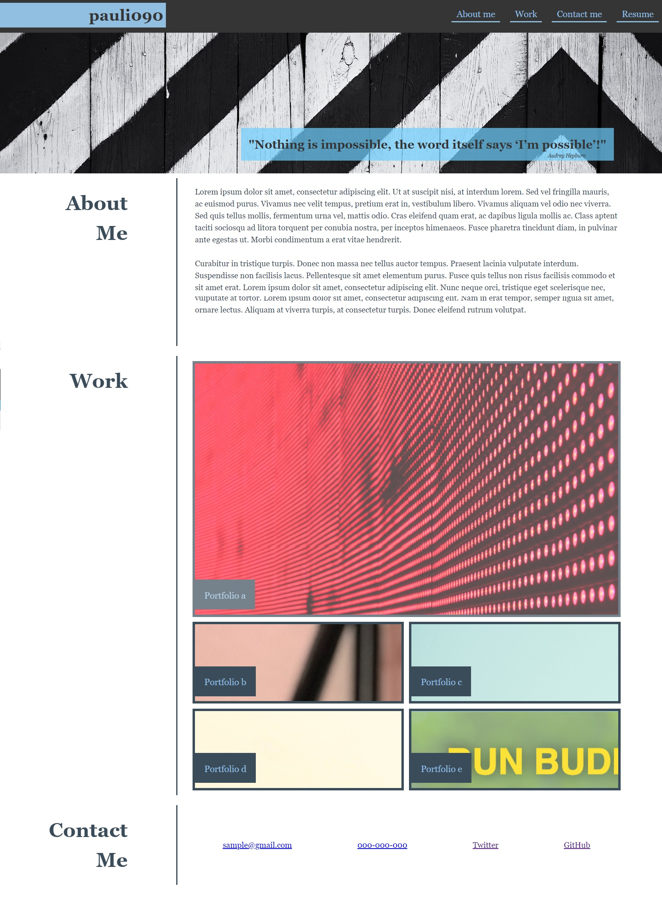

# portfolio-pro

## Description

Professional portfolio sample webside made to meet accessibilty criteria for bootcamp challenge.
The project was created to show usage of display flex and display flex. Thanks to media queries webside is responsive and looks good on every device.

## Instalation

Link to website [PORTFOLIO](https://pauli090.github.io/portfolio-pro/)

## Usage

Webpage was created as a sample for professional portfolio.
In the work section there are placeholders for links to deployed application.

## Credits

I followed tutorials:
 
[w3schools-outline](https://www.w3schools.com/howto/howto_css_outline_buttons.asp)
 
[w3schools-images](https://www.w3schools.com/css/css3_images.asp)
 
[overlay-image-css-grid](https://dev.to/nhuynh1/overlaying-elements-with-css-grid-is-so-much-cleaner-than-with-position-4hcm)
 
[w3schools-background](https://www.w3schools.com/cssref/css3_pr_background-size.php)
 
[z-index](https://developer.mozilla.org/en-US/docs/Web/CSS/z-index?retiredLocale=pl)
 
[w3schools-font-style](https://www.w3schools.com/cssref/pr_font_font-style.php)
 
[underlining](https://sharkcoder.com/visual/underline)
 
Quote source [Audrey-Hepburn](https://livewellkershaw.org/nothing-is-impossible-the-word-itself-says-im-possible-audrey-hepburn-2/)

## License 
MIT

